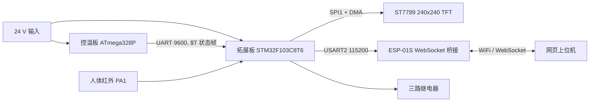

# 智能焊台系统 V2 - V1.0 复刻指南

本项目是在开源 T12 焊台温控方案基础上制作的智能焊台系统。V1.0 版本已经整理成可打板、可烧录、可联调、可复刻的发布结构。

系统由两块板组成：

- 控温板：ATmega328P 主控，负责 T12 烙铁头温度采样、PID 控温、OLED 显示、旋钮交互和焊台状态串口上报。
- 拓展板：STM32F103C8T6 主控，负责读取控温板状态、驱动三路继电器、TFT 彩屏显示、ESP-01S WebSocket 桥接和网页上位机控制。

> 图片占位：整机效果图建议放在 `docs/images/device-overview.jpg`。

## 快速复刻路线

1. 准备控温板和拓展板 PCB、BOM 元件、T12 手柄、24 V 电源、ESP-01S、1.3 寸 240x240 ST7789 TFT 屏。
2. 按 `控温板/Hardware` 和 `拓展板/Hardware` 中的 Gerber 打板，并按 BOM 焊接。
3. 先单独检查电源：24 V 输入、Buck 5 V、LDO 3.3 V、MCU 供电和地线连续性。
4. 烧录控温板 ATmega328P 固件。
5. 烧录拓展板 STM32F103C8T6 固件。
6. 烧录 ESP-01S WebSocket 桥接固件。
7. 按串口协议联调控温板、拓展板和网页上位机。
8. 接入继电器负载和人体传感器前，先使用低压或假负载验证控制逻辑。

## 图片插入约定

后续插入图片时，统一放入：

```text
docs/images/
```

推荐命名：

| 图片内容 | 推荐文件名 |
|---|---|
| 整机效果图 | `device-overview.jpg` |
| 系统架构图 | `system-architecture.png` |
| 控温板正反面 | `control-board-front.jpg` / `control-board-back.jpg` |
| 拓展板正反面 | `extension-board-front.jpg` / `extension-board-back.jpg` |
| 控温板 ISP 接线 | `atmega-isp-wiring.jpg` |
| STM32 SWD 接线 | `stm32-swd-wiring.jpg` |
| ESP-01S 烧录接线 | `esp8266-flash-wiring.jpg` |
| 24 V/5 V/3.3 V 测试点 | `power-test-points.jpg` |
| TFT 显示效果 | `tft-ui.jpg` |
| 网页上位机界面 | `web-ui.png` |

插图语法示例：

```md

```

## 系统架构



> 图片占位：如果后续不想用 Mermaid，可以把重新绘制的架构图放到 `docs/images/system-architecture.png`。

## 目录结构

```text
.
├─ README.md
├─ docs
│  └─ images
├─ 控温板
│  ├─ Hardware
│  │  ├─ SCH_智能焊台控制板_2026-06-07.pdf
│  │  ├─ BOM_T12焊台温控_智能焊台控制板_2026-06-07.xlsx
│  │  └─ Gerber_pcb_copy_2026-06-07.zip
│  └─ Firmware
│     └─ 1.7_uart_nonblocking
│        ├─ 1.7_uart_nonblocking.ino
│        ├─ Arduboy2.cpp / Arduboy2.h / ...
│        └─ build
│           └─ 1.7_uart_nonblocking.ino.hex
└─ 拓展板
   ├─ Hardware
   │  ├─ 原理图-焊台拓展板.pdf
   │  ├─ BOM_Board1_Schematic1_2026-06-07.xlsx
   │  └─ Gerber_PCB1_2026-06-07.zip
   ├─ Firmware
   │  └─ SmartSolder_Extension
   │     └─ C8T6
   │        └─ USER
   │           ├─ SmartSolder_Extension.uvprojx
   │           └─ Objects/SmartSolder_Extension.hex
   └─ Software
      ├─ SmartSolder_Host.html
      └─ ESP01S_WebSocket_Bridge
         └─ ESP01S_WebSocket_Bridge.ino
```

## 设计原理

### 控温板

控温板继承原开源 T12 焊台方案，核心功能是闭环控温。ATmega328P 采样烙铁头热电信号和输入电压，根据设定温度计算加热功率，并通过 MOSFET PWM 控制 T12 发热芯。

控温板保留原 OLED 显示和旋钮交互，同时新增 UART 单向状态上报。新增串口只发送短帧，不接收控制命令，因此不会改变原控温闭环的主逻辑。

### 拓展板

拓展板是智能化扩展层。STM32F103C8T6 接收控温板状态帧，驱动 TFT 显示、三路继电器和 ESP-01S。网页上位机通过 ESP-01S WebSocket 与 STM32 通信，实现远程查看和手动控制。

拓展板有两种工作模式：

- 手动模式：网页上位机控制继电器，人体传感器输入被忽略。
- 自动模式：预留人体传感器逻辑；检测到有人时自动打开照明和风扇，无人时关闭。V1.0 已接入 PA1 非阻塞滤波，实际启用策略可继续调整。

### 通信链路

控温板只负责稳定发送：

```text
ATmega328P PD1/TXD -> STM32 PB11/USART3_RX
```

拓展板只接收控温板数据，不向控温板回写。这样可以降低对原焊台程序的侵入程度，也便于后续替换下位机。

### 显示与网页

TFT 使用 ST7789 240x240 彩屏，界面采用深色仪表盘风格，显示在线状态、温度、目标温度、工作状态、功率、温度曲线和三路继电器状态。

网页上位机显示内容与屏幕接近，并增加调试状态、串口诊断和 WebSocket 日志，便于联调。

## 硬件文件

### 控温板硬件

| 文件 | 说明 |
|---|---|
| `控温板/Hardware/SCH_智能焊台控制板_2026-06-07.pdf` | 控温板原理图 |
| `控温板/Hardware/BOM_T12焊台温控_智能焊台控制板_2026-06-07.xlsx` | 控温板 BOM |
| `控温板/Hardware/Gerber_pcb_copy_2026-06-07.zip` | 控温板 Gerber |

> 图片占位：控温板正反面照片建议放到 `docs/images/control-board-front.jpg` 和 `docs/images/control-board-back.jpg`。

### 拓展板硬件

| 文件 | 说明 |
|---|---|
| `拓展板/Hardware/原理图-焊台拓展板.pdf` | 拓展板原理图 |
| `拓展板/Hardware/BOM_Board1_Schematic1_2026-06-07.xlsx` | 拓展板 BOM |
| `拓展板/Hardware/Gerber_PCB1_2026-06-07.zip` | 拓展板 Gerber |

> 图片占位：拓展板正反面照片建议放到 `docs/images/extension-board-front.jpg` 和 `docs/images/extension-board-back.jpg`。

## 装配与首次上电

首次上电前必须检查：

- 24 V 输入极性正确。
- Buck 输出 5 V 正常。
- LDO 输出 3.3 V 正常。
- ATmega328P、STM32F103C8T6、ESP-01S 和 TFT 的供电电压符合要求。
- 5 V UART 信号进入 STM32 前已经分压到 3.3 V。
- 继电器触点侧与控制侧走线没有短路。
- 大电流回路与信号地连接合理，没有把测温信号地串进负载电流路径。

建议首次测试顺序：

1. 不插 T12 手柄，只测电源。
2. 不接继电器负载，只测 MCU 下载和串口。
3. 接入 TFT，确认屏幕显示。
4. 接入控温板 TX 到拓展板 RX，确认温度状态。
5. 接入 ESP-01S，确认网页能连接。
6. 最后接入继电器实际负载。

> 图片占位：电源测试点照片建议放到 `docs/images/power-test-points.jpg`。

## 控温板固件

正式固件目录：

```text
控温板/Firmware/1.7_uart_nonblocking
```

正式烧录文件：

```text
控温板/Firmware/1.7_uart_nonblocking/build/1.7_uart_nonblocking.ino.hex
```

固件基于原 `1.7` 开源焊台程序修改，保留原控温、显示和交互逻辑，并新增硬件 UART 状态上报。串口发送采用轻量非阻塞状态机，每秒上报一帧设备状态。

### 控温板引脚

| 功能 | ATmega328P 引脚 | Arduino 引脚 | 说明 |
|---|---|---|---|
| 温度采样 | ADC0 | A0 | 烙铁头温度信号 |
| 输入电压采样 | ADC1 | A1 | 输入电压检测 |
| 蜂鸣器 | PD5 | D5 | 蜂鸣器输出 |
| 旋钮按键 | PD6 | D6 | 编码器按下 |
| 旋钮 A 相 | PD7 | D7 | 编码器输入 |
| 旋钮 B 相 | PB0 | D8 | 编码器输入 |
| 加热控制 | PB1 | D9 | MOSFET PWM 控制 |
| 手柄震动开关 | PB2 | D10 | 睡眠/唤醒检测 |
| 状态串口 TX | PD1/TXD | D1 | 向拓展板输出状态 |

ATmega328P-AU TQFP-32 封装中，`PD1/TXD` 对应物理引脚 31。

### 控温板串口参数

| 参数 | 配置 |
|---|---|
| 波特率 | 9600 bps |
| 数据位 | 8 |
| 停止位 | 1 |
| 校验 | None |
| 流控 | None |
| 方向 | 控温板单向发送 |
| 帧结束 | LF，字节值 `0x0A` |
| 上报周期 | 约 1000 ms |

### 控温板烧录

推荐使用 USBasp 通过 ISP 烧录。芯片为 ATmega328P，外部晶振 16 MHz。

USBasp 接线：

| USBasp | ATmega328P |
|---|---|
| MOSI | MOSI |
| MISO | MISO |
| SCK | SCK |
| RST | RESET |
| VCC | 5 V |
| GND | GND |

> 图片占位：控温板 ISP 接线照片建议放到 `docs/images/atmega-isp-wiring.jpg`。

烧录正式固件：

```powershell
& "C:\Users\Antury\AppData\Local\Arduino15\packages\arduino\tools\avrdude\8.0.0-arduino1\bin\avrdude.exe" `
-C "C:\Users\Antury\AppData\Local\Arduino15\packages\arduino\tools\avrdude\8.0.0-arduino1\etc\avrdude.conf" `
-c usbasp -p m328p -B 10 `
-U flash:w:"D:\Workspace\Soldering stationV2\控温板\Firmware\1.7_uart_nonblocking\build\1.7_uart_nonblocking.ino.hex":i
```

推荐熔丝位：

```text
lfuse = 0xFF
hfuse = 0xD9
efuse = 0xFF
```

`lfuse=0xFF` 对应外部晶振运行且 CKDIV8 关闭，适配 16 MHz 时钟。若芯片被错误配置为内部 1 MHz 或 8 MHz，串口波特率会异常。

### 控温板串口稳定性说明

V1.0 修复了 UART 尾字节乱码问题。原因是原程序在 ADC 降噪采样时会进入 `SLEEP_MODE_ADC`，而 UART 最后一个字节可能仍在移位寄存器中发送。V1.0 在进入 ADC sleep 前等待 `TXC0` 发送完成，避免尾部字节被截断。

该修复不改变协议、不改变波特率，也不把整帧发送改成阻塞式。只有在准备进入 ADC sleep 且确实存在未完成 UART 字节时，才等待最后一个字节发送完成。

## 拓展板固件

正式工程：

```text
拓展板/Firmware/SmartSolder_Extension/C8T6/USER/SmartSolder_Extension.uvprojx
```

当前工程输出固件：

```text
拓展板/Firmware/SmartSolder_Extension/C8T6/USER/Objects/SmartSolder_Extension.hex
```

目标 MCU：

```text
STM32F103C8T6
```

工程使用 STM32F10x 标准外设库，开发环境为 Keil uVision。V1.0 已更新源码中的 `FW_VERSION_TEXT`，并已使用 Keil 命令行重新生成 `Objects/SmartSolder_Extension.hex`。最近一次构建结果为 `0 Error(s), 0 Warning(s)`。

### 拓展板关键参数

| 功能 | 配置 |
|---|---|
| 固件版本显示 | `V1.0` |
| 控温板串口 | USART3 RX，9600 8N1 |
| 调试串口 | USART1，115200 8N1 |
| ESP-01S 串口 | USART2，115200 8N1 |
| 下位机在线超时 | 3000 ms |
| ESP 在线超时 | 10000 ms |
| 继电器触发 | 高电平有效 |
| 人体检测 | 高电平有效 |

### 拓展板引脚

| 模块 | 引脚 | 说明 |
|---|---|---|
| 控温板 UART RX | PB11 / USART3_RX | 接 ATmega328P `PD1/TXD` 分压后信号 |
| 控温板 UART TX | PB10 / USART3_TX | 当前预留 |
| 调试串口 TX/RX | PA9 / PA10 | USART1 |
| ESP-01S TX/RX | PA2 / PA3 | USART2 |
| TFT SCL | PA5 / SPI1_SCK | ST7789 SPI 时钟 |
| TFT SDA | PA7 / SPI1_MOSI | ST7789 SPI 数据 |
| TFT BLK | PA8 / TIM1_CH1 | 背光 PWM |
| TFT RES | PB0 | 屏幕复位 |
| TFT DC | PB1 | 数据/命令选择 |
| 继电器 1 | PB13 | 照明灯 |
| 继电器 2 | PB12 | 排风扇 |
| 继电器 3 | PB14 | 预留负载 |
| 人体检测 | PA1 | HC-SR501 或兼容 PIR 输入 |
| 心跳 LED | PC13 | 运行状态指示 |

### 拓展板烧录

推荐使用 ST-Link 通过 SWD 烧录。

SWD 接线：

| ST-Link | STM32F103C8T6 |
|---|---|
| SWDIO | PA13 |
| SWCLK | PA14 |
| 3.3 V | 3.3 V |
| GND | GND |
| NRST | NRST，建议连接 |

> 图片占位：STM32 SWD 接线照片建议放到 `docs/images/stm32-swd-wiring.jpg`。

Keil 中打开：

```text
拓展板/Firmware/SmartSolder_Extension/C8T6/USER/SmartSolder_Extension.uvprojx
```

编译后直接点击 Download，或使用命令行构建：

```powershell
& "D:\data\keilMDK\UV4\UV4.exe" -b "D:\Workspace\Soldering stationV2\拓展板\Firmware\SmartSolder_Extension\C8T6\USER\SmartSolder_Extension.uvprojx" -j0
```

## ESP-01S 固件

ESP-01S 桥接固件：

```text
拓展板/Software/ESP01S_WebSocket_Bridge/ESP01S_WebSocket_Bridge.ino
```

ESP-01S 与 STM32 通信：

```text
ESP-01S TX -> STM32 PA3 / USART2_RX
ESP-01S RX <- STM32 PA2 / USART2_TX
GND 共地
VCC = 3.3 V
```

ESP-01S 下载模式通常需要：

```text
GPIO0 = GND
EN/CH_PD = 3.3 V
RST = 3.3 V，下载前可短暂拉低复位
VCC = 3.3 V
GND = GND
TX/RX 交叉连接 USB-TTL
```

> 图片占位：ESP-01S 烧录接线照片建议放到 `docs/images/esp8266-flash-wiring.jpg`。

烧录完成后，ESP-01S 提供 WebSocket 服务：

```text
ws://<ESP_IP>:81/
```

## 网页上位机

网页文件：

```text
拓展板/Software/SmartSolder_Host.html
```

使用方式：

1. 烧录并启动 ESP-01S 桥接固件。
2. 让电脑或手机连接到同一网络。
3. 打开 `SmartSolder_Host.html`。
4. 输入 ESP-01S 的 IP 地址，连接 WebSocket。
5. 查看温度、模式、继电器状态、调试信息，并在手动模式下控制负载。

> 图片占位：网页界面截图建议放到 `docs/images/web-ui.png`。

## 控温板到拓展板连接

推荐电平转换：

```text
ATmega328P PD1/TXD -- R上 5.1k --+-- STM32 PB11/RX
                                  |
                                R下 10k
                                  |
                                 GND

ATmega GND ------------------------ STM32 GND
```

该分压将 ATmega 5 V UART 高电平转换到约 3.3 V。若沿用早期 `10k/20k` 分压也能得到约 3.33 V，但驱动能力更弱；V1.0 推荐 `5.1k/10k`。

注意：

- PB11 不建议直接承受 5 V UART。虽然 STM32F103 的部分 IO 是 5 V tolerant，但复用模拟、上拉、输入保护和具体封装条件容易引入风险，分压更稳。
- ATmega 与 STM32 必须共地。
- UART 走线远离 24 V 输入、继电器线圈、加热 MOSFET 和大电流回路。
- STM32 RX 旁可预留 100R 串联电阻位。
- STM32 RX 旁可预留 10k 上拉/下拉焊盘，默认不焊。

## 状态报文协议

控温板发送格式：

```text
$T,<current_temp>,<set_temp>,<power_percent>,<mode>\n
```

示例：

```text
$T,326,350,42,H\n
```

字段说明：

| 字段 | 类型 | 说明 |
|---|---|---|
| `$T` | 固定字符串 | 状态帧头 |
| `current_temp` | 十进制整数 | 当前温度，单位摄氏度；异常时为 `999` |
| `set_temp` | 十进制整数 | 当前设定温度，单位摄氏度 |
| `power_percent` | 十进制整数 | 加热功率百分比，范围 `0-100` |
| `mode` | 单个 ASCII 字符 | 运行状态 |
| `\n` | `0x0A` | 帧结束符 |

状态码：

| 状态码 | 名称 | 含义 |
|---|---|---|
| `E` | Error | 未插入手柄、烙铁头异常或温度检测异常 |
| `O` | Off | 关闭/停机模式 |
| `S` | Sleep | 睡眠模式 |
| `B` | Boost | Boost 加热模式 |
| `W` | Working | 稳定工作状态 |
| `H` | Heating | 正在加热 |
| `L` | Holding | 低功率维持或保温 |

正常工作示例：

```text
$T,320,320,12,W
$T,322,380,100,B
$T,381,320,0,L
```

未插入手柄示例：

```text
$T,999,320,0,E
```

STM32 接收策略：

1. 接收字节流。
2. 遇到 `$` 重新同步帧头。
3. 只在帧内接收 ASCII 可打印字符。
4. 遇到 LF `0x0A` 结束一帧。
5. 最大帧长 32 字节，超长直接丢弃并等待下一个 `$`。
6. 解析时要求字段数量为 5。
7. 只把合法帧用于刷新设备在线状态。

在线判断：

```text
收到合法 $T 帧：在线
连续 3 秒未收到合法 $T 帧：离线
收到坏帧：丢弃，不立即判离线
```

## 联调流程

### 1. 单独验证控温板串口

用 USB-TTL 直接接 ATmega328P `PD1/TXD`，串口参数为 `9600 8N1`。串口助手应能看到稳定 `$T` 帧。

若电脑端稳定而拓展板不稳定，优先检查：

- ATmega TX 到 STM32 PB11 的分压。
- 共地。
- PB11 是否被错误初始化为 I2C、GPIO 输出或其他复用。
- STM32 USART3 波特率是否为 9600。
- 是否存在干扰、虚焊或 RX 走线过长。

### 2. 验证拓展板下位机诊断

网页调试信息中重点看：

- `rxBytes`：是否收到字节。
- `lines`：是否收到 LF 结束帧。
- `valid`：合法帧数量。
- `bad`：坏帧数量。
- `overflow`：帧过长或缓冲溢出。
- `ore/fe/ne/pe`：USART 硬件错误计数。
- `raw`：最近一帧原始内容。

### 3. 验证 TFT 与网页

TFT 应显示：

- 在线/离线状态。
- 手动/自动模式。
- 当前温度、目标温度、功率。
- 60 秒温度曲线。
- R1/R2/R3 三路继电器状态。

网页应显示同样核心状态，并附带串口和 WebSocket 调试信息。

> 图片占位：TFT 显示效果建议放到 `docs/images/tft-ui.jpg`。

### 4. 验证继电器

V1.0 继电器定义：

| 继电器 | STM32 引脚 | 功能 | 触发方式 |
|---|---|---|---|
| R1 | PB13 | 照明灯 | 高电平有效 |
| R2 | PB12 | 排风扇 | 高电平有效 |
| R3 | PB14 | 预留负载 | 高电平有效 |

测试实际负载前，建议先用万用表或小功率假负载确认动作逻辑。

## 常见问题

### USBasp 找不到设备

现象：

```text
cannot find USB device with vid=0x16c0 pid=0x5dc
```

处理：

- 确认 Zadig 中选择的是真正插拔会消失的 USBasp 设备。
- 驱动可尝试 `libusbK` 或 `WinUSB`，但不同 USBasp 固件兼容性不同。
- 如果下载器 VID/PID 不是标准 USBasp，需要在 avrdude 配置中添加对应 programmer。

### avrdude 提示 target does not answer

可能原因：

- MOSI/MISO/SCK/RST 接错。
- 目标板未供电或 GND 未共地。
- 新片时钟配置与实际晶振不匹配。
- ISP SCK 过快。

可尝试降低 ISP 速度：

```powershell
-B 125kHz
```

### 串口只能看到开机几帧，之后离线

优先检查拓展板侧：

- PB11 是否确实只作为 USART3_RX。
- RX 分压是否过大导致边沿太慢。
- USART3 是否有 ORE/FE/NE 错误。
- 控温板 TX 与拓展板 RX 是否共地。
- 是否把 `\n` 误判成必须 `\r\n`。

### 屏幕数字闪烁或笔画缺失

通常是局部刷新区域、字模绘制背景、SPI DMA 刷新时序或重复清屏策略导致。V1.0 的界面原则是只更新变化区域，避免全屏高频刷新。

### ESP-01S 显示 IP 为 0.0.0.0

常见原因：

- ESP 尚未连接 WiFi。
- STM32 与 ESP 串口未同步。
- ESP 固件没有正确上报 IP。
- STM32 在未收到 ESP 有效状态前显示了默认地址。

## 安全注意事项

- 焊台涉及 24 V 大电流和高温烙铁头，首次调试不要无人值守。
- 继电器控制外部负载时，要确认触点电压、电流和绝缘距离满足实际负载要求。
- 24 V 输入端建议使用保险丝、反接保护和足够线宽。
- T12 加热回路、电源回路和信号采样回路要避免共用细长回流路径。
- ESP-01S 只能使用 3.3 V 供电和 3.3 V 串口电平。
- STM32 的 PB11 接 ATmega 5 V TX 时必须做电平转换或分压。
- 烧录前确认目标芯片型号，ATmega328P 和 ATmega328 的 avrdude part 参数不同。

## V1.0 验收项

控温板：

- 使用 USBasp 可烧录 `1.7_uart_nonblocking.ino.hex`。
- ATmega328P 工作于 16 MHz 外部晶振。
- 未插手柄时串口输出 `current_temp=999`、`mode=E`。
- 插入手柄后温度可稳定调节并输出 `$T` 状态帧。
- 串口尾字节不再出现乱码或截断。

拓展板：

- USART3 能稳定解析控温板 `$T` 帧。
- 超过 3 秒未收到合法帧时判定控温板离线。
- 三路继电器可通过网页或本地逻辑控制。
- TFT 显示温度、模式、在线状态、继电器状态和温度曲线。
- ESP-01S WebSocket 桥接可连接网页上位机。

## 已知限制

- 控温板串口目前只支持状态上报，不支持拓展板向控温板下发控制命令。
- 状态帧未包含校验和，短距离板间通信依靠帧头、字段数量、字段范围和超时机制保证可靠性。
- TFT 中文显示使用项目内置取模资源，新增中文需要继续补充字模。
- 自动模式依赖人体检测输入，实际延时策略需要结合现场使用习惯调整。

## 发布清理说明

V1.0 发布包已移除：

- 控温板串口诊断固件和短报文测试固件。
- 控温板临时编译探测目录。
- 控温板完整第三方依赖仓库副本。
- 拓展板早期 `BodyIR` 实验工程。
- 分散且重复的旧版 Markdown 说明文档。

保留内容仅包括 V1.0 复刻、烧录、联调和发布所需的硬件文件、正式固件、网页上位机和 ESP-01S 桥接固件。
