# 智能焊台系统 V2.1 复刻指南

本项目是在开源 T12 焊台温控方案基础上制作的智能焊台系统。系统保留独立、可靠的 T12 控温功能，并增加彩屏状态显示、三路继电器、人体感应、ESP-01S 联网和网页上位机。


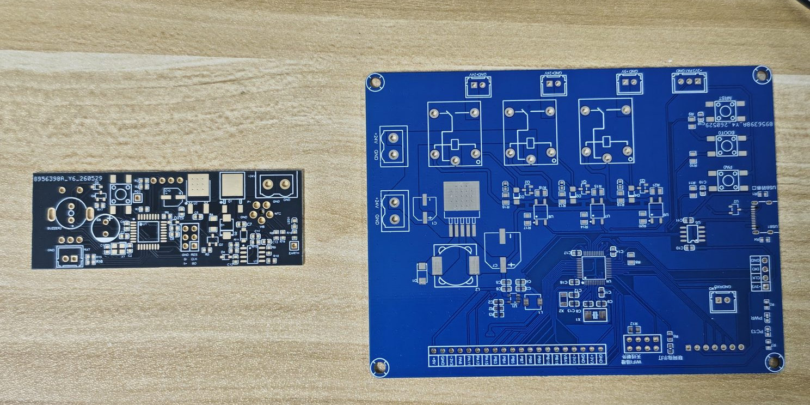

## 目录

1. [项目整体框架](#1-项目整体框架)
2. [硬件复刻步骤](#2-硬件复刻步骤)
3. [程序烧录与软件使用](#3-程序烧录与软件使用)
4. [电路设计与工作原理](#4-电路设计与工作原理)
5. [系统联调与验收](#5-系统联调与验收)
6. [常见问题](#6-常见问题)
7. [附录](#7-附录)

## 1. 项目整体框架

### 1.1 系统组成

系统由以下部分组成：

| 模块 | 主要器件 | 作用 |
|---|---|---|
| 控温板 | ATmega328P | 温度采样、PID 控温、加热驱动、旋钮和 OLED 交互 |
| 拓展板 | STM32F103C8T6 | 接收焊台状态、驱动 TFT、继电器、人体传感器和 ESP-01S |
| T12 手柄 | T12 烙铁头、航空插头、震动开关 | 加热、测温和睡眠检测 |
| 电源 | 24V 直流电源 | 为控温板、拓展板和 T12 加热回路供电 |
| 联网模块 | ESP-01S | 在 WiFi 与 STM32 串口之间建立 WebSocket 桥接 |
| 网页上位机 | 离线 HTML 页面 | 显示状态、调试信息并控制继电器 |

### 1.2 系统架构

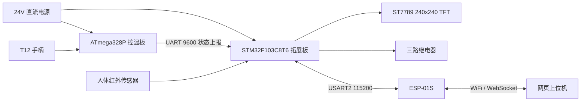
```mermaid
flowchart LR
    POWER["24V 直流电源"] --> CTRL["ATmega328P 控温板"]
    POWER --> EXT["STM32F103C8T6 拓展板"]
    HANDLE["T12 手柄"] --> CTRL
    CTRL -->|"UART 9600 状态上报"| EXT
    EXT --> TFT["ST7789 240x240 TFT"]
    EXT --> RELAY["三路继电器"]
    PIR["人体红外传感器"] --> EXT
    EXT <-->|"USART2 115200"| ESP["ESP-01S"]
    ESP <-->|"WiFi / WebSocket"| WEB["网页上位机"]
```

### 1.3 两块主控板的职责边界

控温板独立完成所有基础焊台功能。即使拓展板、ESP-01S 或网页出现异常，控温板仍应能够继续完成温度控制。

拓展板不参与底层 PID 控温，只接收控温板上报的状态，并负责：

- TFT 彩屏状态显示和温度曲线。
- 三路继电器控制。
- 手动模式和自动模式。
- 人体红外传感器输入。
- ESP-01S 和网页上位机通信。
- 串口诊断和设备在线判断。

### 1.4 主要功能

- 控温板每秒发送一帧温度和工作状态。
- 拓展板连续 3 秒未收到合法状态帧时，将控温板判定为离线。
- TFT 显示温度、工作状态、在线状态、温度曲线和继电器状态。
- 网页上位机支持状态查看、继电器控制和串口诊断。
- 自动模式已保留人体检测控制逻辑。

## 2. 硬件复刻步骤

### 2.1 准备材料与工具

#### 必要模块

- 控温板 PCB 和 BOM 元件。
- 拓展板 PCB 和 BOM 元件。
- T12 烙铁头、手柄外壳、航空插头和耐热线。
- 24V 直流电源。
- 1.3 寸、240x240、7 针 ST7789 TFT 屏幕。
- ESP-01S。
- 三路继电器对应的照明、风扇或其他负载。
- 人体红外传感器，可后续安装。

#### 烧录和调试工具

- USBasp：烧录 ATmega328P。
- ST-Link：烧录 STM32F103C8T6。
- 3.3V USB-TTL：烧录 ESP-01S 和检查串口。
- 万用表、可调电源、焊台和示波器，示波器非必须但推荐。

#### 制作文件

| 板卡 | 原理图 | BOM | Gerber |
|---|---|---|---|
| 控温板 | `控温板/Hardware/SCH_智能焊台控制板_2026-06-07.pdf` | `控温板/Hardware/BOM_T12焊台温控_智能焊台控制板_2026-06-07.xlsx` | `控温板/Hardware/Gerber_pcb_copy_2026-06-07.zip` |
| 拓展板 | `拓展板/Hardware/原理图-焊台拓展板.pdf` | `拓展板/Hardware/BOM_Board1_Schematic1_2026-06-07.xlsx` | `拓展板/Hardware/Gerber_PCB1_2026-06-07.zip` |

### 2.2 制作控温板

控温板负责焊台最核心的温度控制。焊接和首次上电时，应优先保证电源、温度采样和加热驱动部分正确。

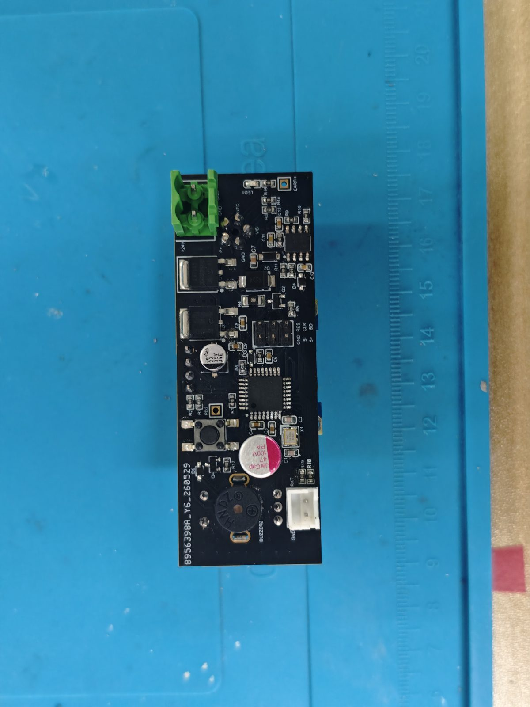

#### 推荐焊接顺序

1. 焊接小封装电阻、电容和二极管。
2. 焊接运放、ATmega328P 和其他 IC。
3. 焊接晶振、三极管、MOSFET 和电解电容。
4. 焊接接插件、旋钮、OLED 和航空插座。
5. 检查所有 IC 方向、二极管方向和电解电容极性。
6. 不接 T12 手柄，先进行限流上电测试。

#### 首次上电检查

- 24V 输入没有短路。
- MCU 电源电压正确。
- ATmega328P 复位脚电平正常。
- 温度采样输入没有被 24V 或加热回路异常拉高。
- 加热 MOSFET 在 MCU 未运行时保持关闭。
- 不插手柄时，串口应上报异常状态，而不是持续加热。

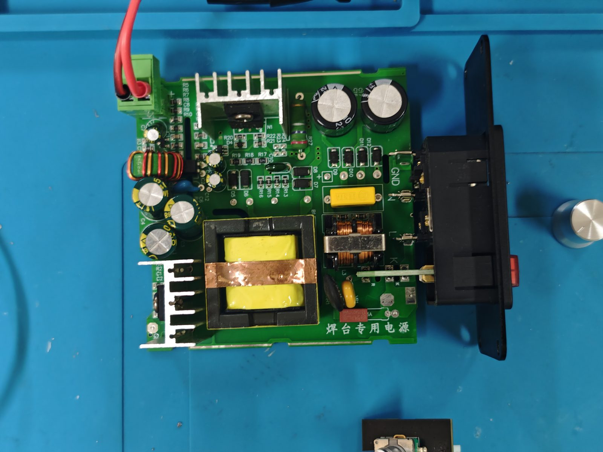

#### 面板安装

面板包括旋钮、OLED 和 T12 手柄航空插座。安装前先确认屏幕方向、旋钮高度和航空插座定位。

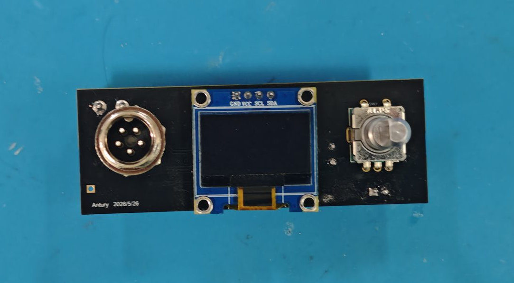

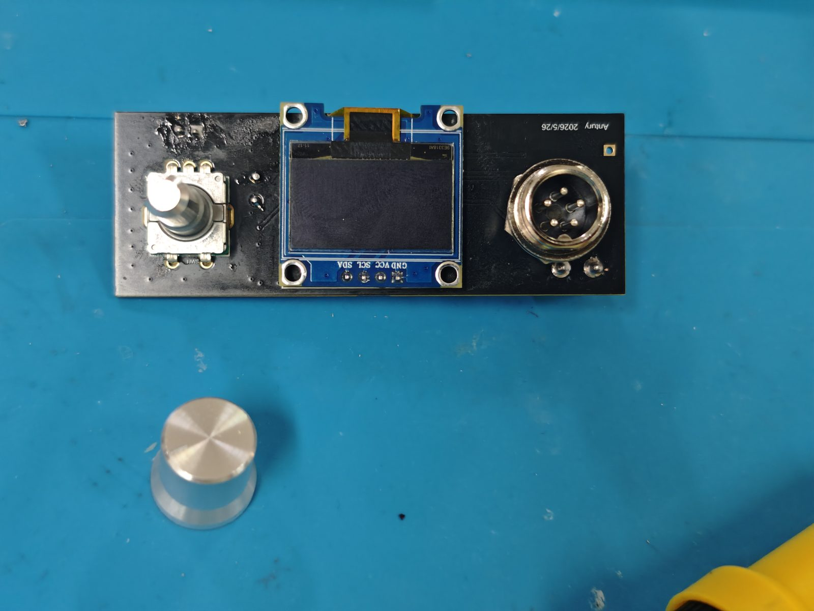

### 2.3 制作拓展板

拓展板负责智能化功能。它包含 STM32 最小系统、电源转换、TFT 接口、ESP-01S 接口、三路继电器驱动和传感器接口。

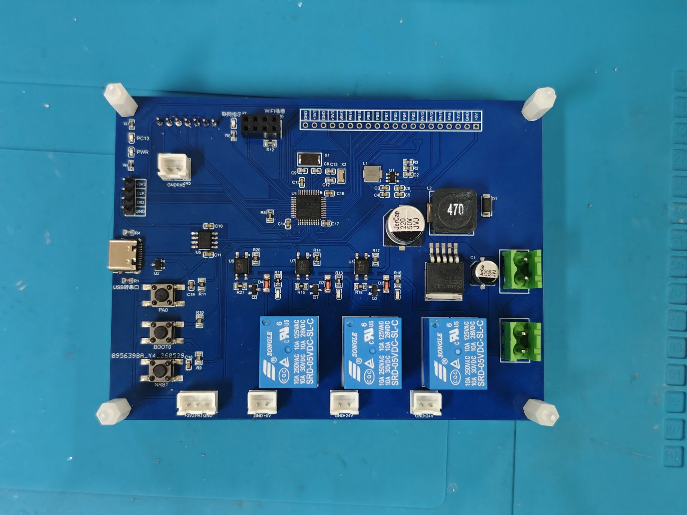

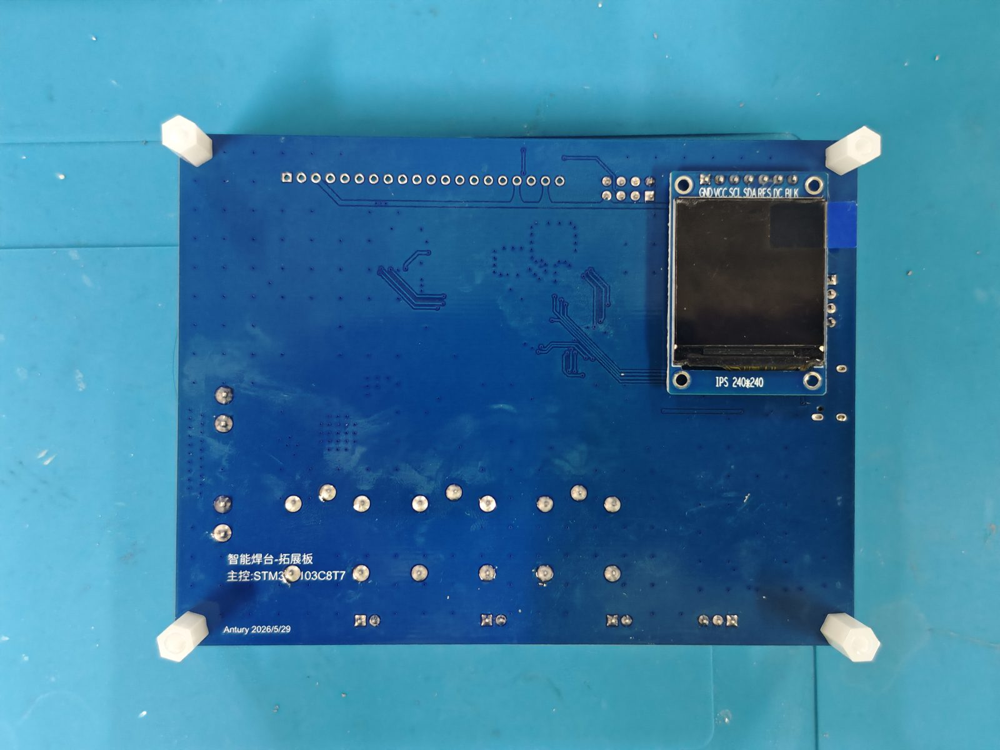

#### 推荐焊接顺序

1. 焊接 24V 转 5V 和 5V 转 3.3V 电源部分。
2. 在不安装 STM32、ESP-01S 和 TFT 时，先验证 5V 与 3.3V。
3. 焊接 STM32 最小系统、晶振、复位和 SWD 接口。
4. 焊接继电器驱动、续流二极管和状态 LED。
5. 焊接 TFT、ESP-01S、串口和人体传感器接口。
6. 检查继电器触点侧与控制侧是否存在短路。

#### 首次上电检查

- 24V 输入极性正确。
- 5V 和 3.3V 输出正确且稳定。
- STM32、ESP-01S 和 TFT 只接入规定电压。
- 三路继电器上电时不会误动作。
- PC13 心跳 LED 能反映 STM32 运行状态。
- ST-Link 能通过 SWD 识别 STM32。

### 2.4 制作 T12 手柄

T12 手柄内部需要完成烙铁头连接、震动开关连接和可靠绝缘。具体航空插头引脚定义必须与控温板原理图一致，不要仅凭线色判断。

所需零件通常包括：

- T12 烙铁头。
- 手柄外壳。
- 航空插头和耐热线。
- 震动开关。
- 金属套筒和固定件。

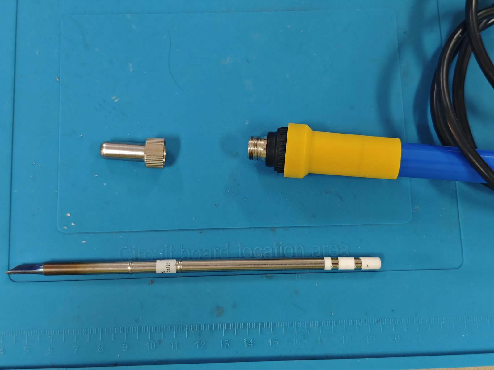

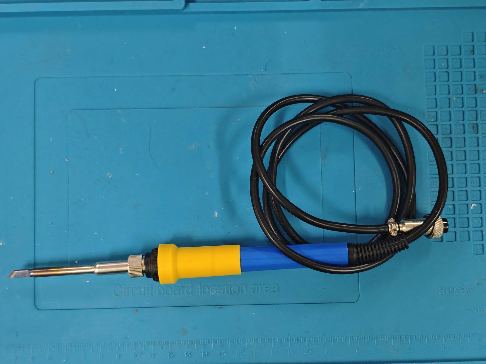

#### 手柄制作步骤

1. 按控温板原理图确认航空插头每个引脚的功能。
    航空插头端子有标号，可以按照以下的标号对应颜色和原理图上的引脚进行连接：
    1 - P+ - 红色
    2 - P- - 黑色
    3 - 震动开关 - 蓝色
    4 - NTC - 绿色
    5 - GND - 白色
2. 连接 T12 烙铁头的加热、测温和公共端。
3. 接入震动开关，用于睡眠和唤醒检测。
4. 使用耐热线，并对所有焊点进行绝缘。
5. 固定线缆，避免插拔和旋转时焊点受力。
6. 装入外壳前检查短路、电阻和线序。

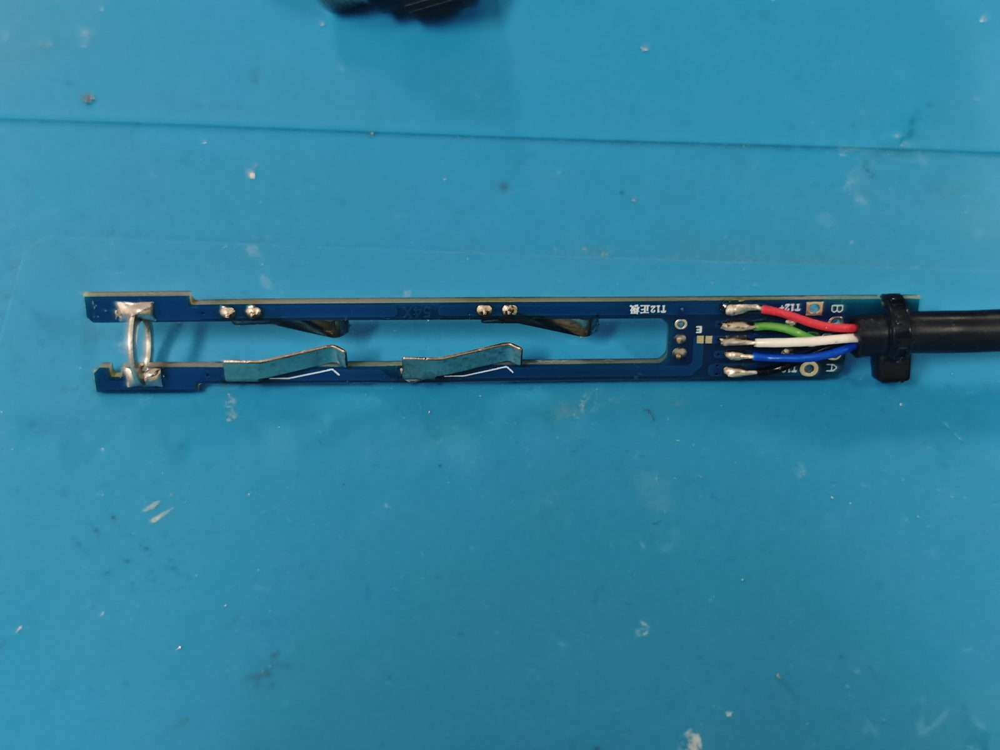

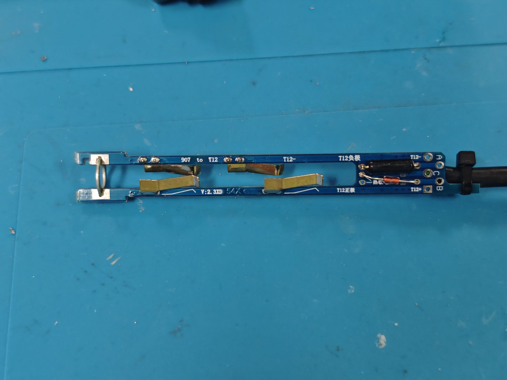

链接：https://item.taobao.com/item.htm?from=cart&id=26086912633&mi_id=0000AXgr_4BibsjmPJoyvk70BG-X1g8eVvtgG86N6ijDUh8&skuId=5064696781991&spm=a1z0d.6639537%2F202410.item.d26086912633.3d387484gg3ySq&upStreamPrice=1450

手柄部分的接线和焊接非常考验手法，建议多购买几套留足冗余。强烈建议额外再多购买一些航空插头。
航空插头（5芯）链接：https://item.taobao.com/item.htm?id=26041200656&mi_id=0000aOAv2BSPKLhhgNeWjllb1Sdm0F2MTRFrBsk3VAEMLvI&skuId=30475582937&spm=a21xtw.29978516.0.0&xxc=shop

一定要搭配T12烙铁头网上有很多不同型号的是不能通用的。

#### 接入前检查

- 加热端与外壳之间没有短路。
- 各引脚线序与控温板定义一致。
- 震动开关动作正常。
- 线缆和焊点可以承受手柄工作温度。

### 2.5 选择和连接电源

系统使用 24V 4A 直流输入。电源不仅要满足控温板和拓展板的静态功耗，还要能够提供 T12 烙铁头快速升温时的功率。

建议：

- 使用质量可靠、带保护功能的 24V 电源。
- 根据烙铁头功率和其他负载预留足够电流余量。
- 输入端增加保险丝、总电源开关和可靠接线端子。
- 24V 大电流线、加热回路和继电器负载线使用足够线宽。
- 外壳为金属时，按实际电源类型正确处理保护地。


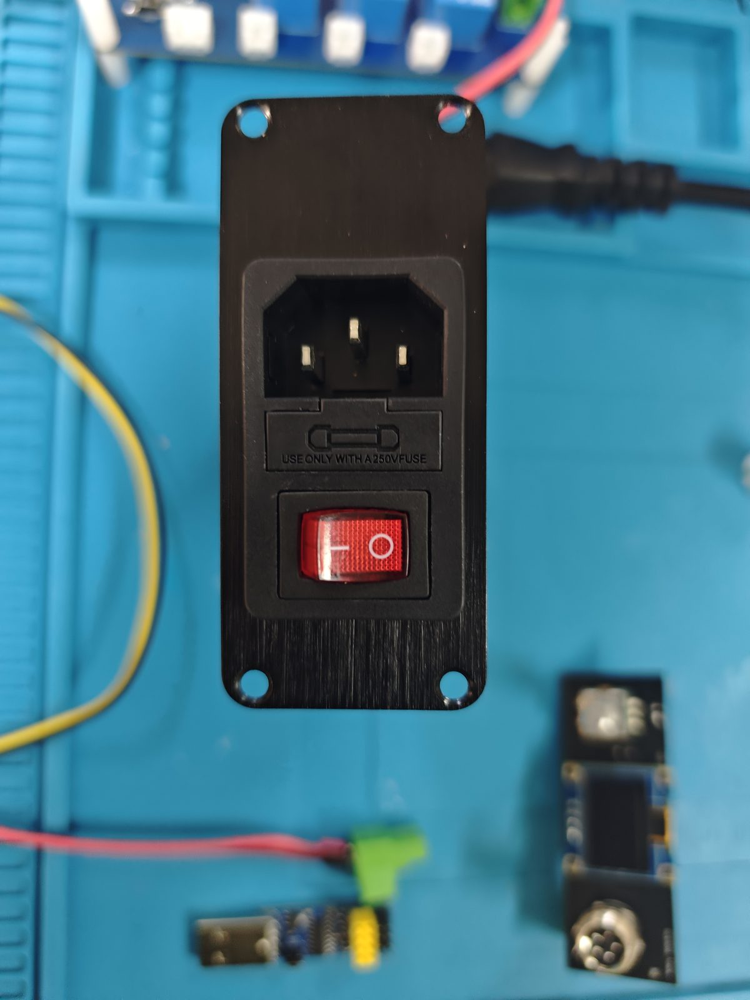

链接：https://item.taobao.com/item.htm?from=cart&id=655098743974&mi_id=0000ZynsqGnorBwP59KCx6Z24IuPDFeSyUg-1SKJYSMWF9I&skuId=4719497252137&spm=a1z0d.6639537%2F202410.item.d655098743974.3d387484gg3ySq&upStreamPrice=3200

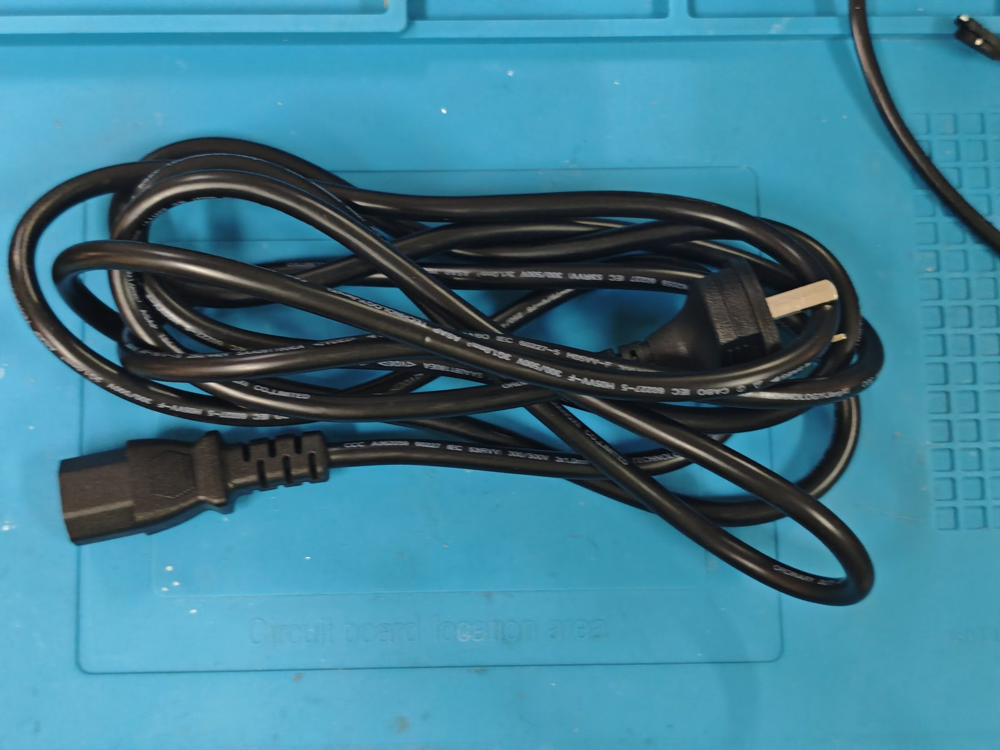

### 2.6 连接两块主控板

控温板通过硬件 UART 单向向拓展板上报状态：

```text
ATmega328P PD1/TXD -> STM32 PB11/USART3_RX
ATmega GND         -> STM32 GND
```

ATmega328P 工作在 5V，STM32 工作在 3.3V。推荐在 UART 信号线上使用分压：

```text
ATmega328P PD1/TXD -- 5.1k --+-- STM32 PB11/USART3_RX
                              |
                             10k
                              |
                             GND
```

该分压会将 5V 高电平转换到约 3.3V。两块板必须共地，UART 走线应远离加热 MOSFET、继电器线圈和大电流回路。


### 2.7 系统首次上电

不要在第一次上电时同时接入所有模块和实际负载。推荐顺序：

1. 单独验证控温板电源。
2. 单独验证拓展板 5V 和 3.3V 电源。
3. 烧录两块主控板程序。
4. 单独检查控温板串口输出。
5. 连接控温板和拓展板 UART。
6. 接入 TFT 和 ESP-01S。
7. 使用万用表或小功率假负载测试继电器。
8. 最后接入 T12 手柄和实际负载。

## 3. 程序烧录与软件使用

### 3.1 烧录控温板 ATmega328P

正式源码：

```text
控温板/Firmware/1.7_uart_nonblocking/1.7_uart_nonblocking.ino
```

正式 HEX：

```text
控温板/Firmware/1.7_uart_nonblocking/build/1.7_uart_nonblocking.ino.hex
```

芯片为 ATmega328P，使用 16MHz 外部晶振。推荐使用 USBasp 通过 ISP 烧录。


#### ISP 接线

| USBasp | ATmega328P |
|---|---|
| MOSI | MOSI |
| MISO | MISO |
| SCK | SCK |
| RST | RESET |
| VCC | 5V |
| GND | GND |

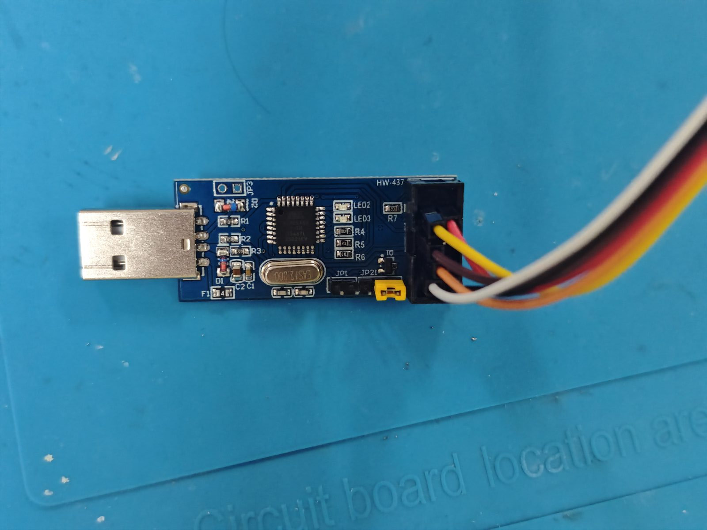

USBASP市面上有大量假货，优先购买不带外壳的款式。

#### 推荐熔丝位

```text
lfuse = 0xFF
hfuse = 0xD9
efuse = 0xFF
```

`lfuse=0xFF` 对应 16MHz 外部晶振运行，并关闭 CKDIV8。时钟配置错误会导致 UART 波特率异常。

#### avrdude 烧录示例

将 `<AVRDUDE>`、`<AVRDUDE_CONF>` 和 `<FIRMWARE_HEX>` 替换为本机实际路径：

```powershell
& "<AVRDUDE>" `
-C "<AVRDUDE_CONF>" `
-c usbasp -p m328p -B 10 `
-U flash:w:"<FIRMWARE_HEX>":i
```

### 3.2 烧录拓展板 STM32F103C8T6

Keil 工程：

```text
拓展板/Firmware/SmartSolder_Extension/C8T6/USER/SmartSolder_Extension.uvprojx
```

编译输出：

```text
拓展板/Firmware/SmartSolder_Extension/C8T6/USER/Objects/SmartSolder_Extension.hex
```

使用 ST-Link 通过 SWD 烧录：

| ST-Link | STM32F103C8T6 |
|---|---|
| SWDIO | PA13 |
| SWCLK | PA14 |
| 3.3V | 3.3V |
| GND | GND |
| NRST | NRST，建议连接 |

在 Keil 中打开工程，完成编译后点击 Download。烧录完成后复位拓展板，并检查 PC13 心跳 LED 和 TFT 是否正常运行。

### 3.3 烧录 ESP-01S

固件位置：

```text
拓展板/Software/ESP01S_WebSocket_Bridge/ESP01S_WebSocket_Bridge.ino
```

ESP-01S 下载模式：

```text
GPIO0 = GND
EN/CH_PD = 3.3V
RST = 3.3V，下载前可短暂拉低复位
VCC = 3.3V
GND = GND
TX/RX 交叉连接 3.3V USB-TTL
```

烧录完成后移除 GPIO0 与 GND 的连接，再重新上电运行。ESP-01S 与 STM32 使用 USART2 通信：

```text
ESP-01S TX -> STM32 PA3 / USART2_RX
ESP-01S RX <- STM32 PA2 / USART2_TX
```
这个固件存放了设备连接的wifi配置，建议不直接使用hex下载，不然只能修改成项目对应的热点，这个设计的初衷还是为了方便维护和使用。
建议自己打开arduino IDE亲自配置一下库和下载参数，在你的电脑上完整的跑一遍编译和烧录。
推荐的小烧录器：
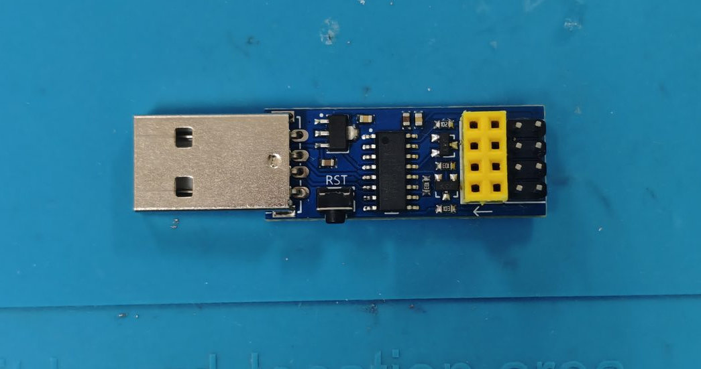

ESP-01S 提供 WebSocket 服务：

```text
ws://<ESP_IP>:81/
```

### 3.4 TFT 界面

拓展板使用 ST7789 240x240 TFT。屏幕显示：

- 控温板在线/离线状态。
- 手动/自动模式。
- 当前温度、设定温度和加热功率。
- 控温板工作状态。
- 最近温度曲线。
- R1、R2、R3 三路继电器状态。

屏幕通过 SPI1 和 DMA 发送数据，界面采用局部刷新，避免每次变化都刷新全屏。

### 3.5 网页上位机

网页文件：

```text
拓展板/Software/SmartSolder_Host.html
```

使用步骤：

1. 烧录并启动 ESP-01S。
2. 让电脑或手机连接到相同网络。
3. 打开 `SmartSolder_Host.html`。
4. 输入 ESP-01S IP 地址并连接 WebSocket。
5. 查看温度、工作模式、继电器状态和调试信息。
6. 在手动模式下控制三路继电器。

### 3.6 手动与自动模式

手动模式：

- 继电器由网页命令控制。
- 人体传感器状态被忽略。

自动模式：

- 检测到有人时自动打开照明灯和排风扇。
- 无人持续一段时间后自动关闭。
- 人体输入经过非阻塞滤波，避免短时跳变造成继电器频繁动作。

## 4. 电路设计与工作原理

本章从两块主控板的电路设计入手。原理图是最终判断依据，本文用于说明各功能模块之间的关系和设计目的。

### 4.1 控温板电路设计

#### 4.1.1 控温板总体结构

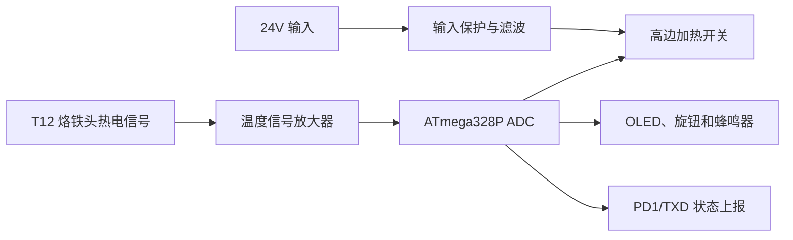
```mermaid
flowchart LR
    VIN["24V 输入"] --> FILTER["输入保护与滤波"]
    FILTER --> HEATER["高边加热开关"]
    TIP["T12 烙铁头热电信号"] --> AMP["温度信号放大器"]
    AMP --> MCU["ATmega328P ADC"]
    MCU --> HEATER
    MCU --> UI["OLED、旋钮和蜂鸣器"]
    MCU --> UART["PD1/TXD 状态上报"]
```

控温板的核心闭环是：

1. 停止或降低加热。
2. 读取 T12 烙铁头产生的微弱热电信号。
3. 运放将信号放大到 ADC 可测范围。
4. ATmega328P 将温度与设定值比较。
5. PID 算法计算下一阶段加热功率。
6. 高边开关控制 T12 加热。

#### 4.1.2 24V 输入、滤波和地线

24V 输入同时承担 T12 加热功率和控制电路供电。大电流加热会产生电压波动和回流压降，因此 PCB 布局必须避免让测温放大器和 MCU 的信号地串入加热电流路径。

电源部分的大容量电容用于：

- 缓冲加热开关动作产生的瞬时电流变化。
- 降低输入线缆阻抗引起的电压波动。
- 为控制电路提供较稳定的局部电源。

小容量去耦电容负责抑制高频噪声，不能由单颗大电解电容完全替代。

原理图中出现不同 GND 标识时，应确认它们是否最终单点连接。功率地负责加热电流回流，信号地负责运放和 MCU 参考电位，两者布局上需要区分，但不能在不明确设计目的时完全悬空隔离。

#### 4.1.3 温度信号放大器

T12 烙铁头在非加热阶段会产生与温度相关的微弱电压。该信号幅度不足以直接充分利用 ATmega328P ADC 量程，因此需要 `Thermal Signal Amplifier`：

- 对热电信号进行放大。
- 对高频干扰进行滤波。
- 将信号调整到 ADC 可测范围。
- 为 MCU 提供稳定、低阻抗的采样信号。

运放输入连接 `P+`，是因为 T12 烙铁头的加热和温度检测共用相关端点。电路需要在停止加热后，通过该节点读取热电信号。测温阶段必须避开强加热电流，否则采样值会被开关噪声和压降淹没。

#### 4.1.4 高边加热开关

`High-Side Heater Switch` 位于 24V 与 T12 加热端之间，用于控制加热电流。它通常由功率 MOSFET 和驱动器件组成。

采用高边开关的主要目的：

- 保持手柄公共参考端更接近系统地。
- 便于温度信号放大器以稳定参考电位测量。
- 减少低边开关造成的公共端电位跳动。

ATmega328P 根据 PID 输出控制加热占空比。加热停止后，电路等待开关噪声衰减，再进行温度采样。

#### 4.1.5 ATmega328P 最小系统和交互

ATmega328P 负责：

- ADC0 温度采样。
- ADC1 输入电压采样。
- PB1/D9 加热 PWM。
- 编码器和按键读取。
- OLED 显示。
- 蜂鸣器提示。
- 手柄震动开关检测。
- PD1/TXD 状态上报。

主要引脚：

| 功能 | ATmega328P 引脚 | Arduino 引脚 |
|---|---|---|
| 温度采样 | ADC0 | A0 |
| 输入电压采样 | ADC1 | A1 |
| 蜂鸣器 | PD5 | D5 |
| 旋钮按键 | PD6 | D6 |
| 旋钮 A 相 | PD7 | D7 |
| 旋钮 B 相 | PB0 | D8 |
| 加热控制 | PB1 | D9 |
| 手柄震动开关 | PB2 | D10 |
| 状态串口 TX | PD1/TXD | D1 |

#### 4.1.6 控温板 UART 上报

串口采用 `9600 8N1`，控温板只发送、不接收。每约 1 秒发送一帧状态：

```text
$T,<current_temp>,<set_temp>,<power_percent>,<mode>\n
```

串口发送采用轻量非阻塞状态机。进入 ADC sleep 前会确认 UART 最后一个字节已经发送完成，避免状态帧尾部被截断。

### 4.2 拓展板电路设计

#### 4.2.1 拓展板总体结构

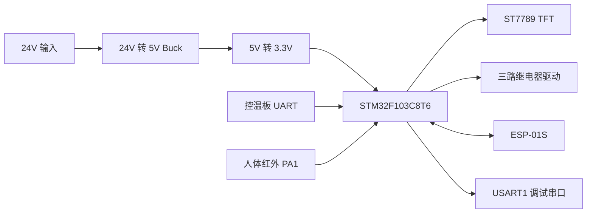
```mermaid
flowchart LR
    VIN["24V 输入"] --> BUCK["24V 转 5V Buck"]
    BUCK --> LDO["5V 转 3.3V"]
    LDO --> MCU["STM32F103C8T6"]
    LOWER["控温板 UART"] --> MCU
    PIR["人体红外 PA1"] --> MCU
    MCU --> TFT["ST7789 TFT"]
    MCU --> RELAY["三路继电器驱动"]
    MCU <--> ESP["ESP-01S"]
    MCU --> DEBUG["USART1 调试串口"]
```

#### 4.2.2 24V、5V 和 3.3V 电源

拓展板从 24V 输入获得电源：

1. DC-DC Buck 将 24V 降到 5V，为继电器等 5V 负载供电。
2. 3.3V 稳压电路为 STM32、ESP-01S 和 TFT 逻辑供电。

设计时需要注意：

- Buck 输入耐压必须高于实际 24V 输入及其浪涌。
- 输入、输出电容应满足所选稳压芯片的数据手册要求。
- ESP-01S 发射 WiFi 时存在瞬时电流，3.3V 电源必须有足够余量。
- 每个 IC 电源脚附近都应放置小容量去耦电容。
- 大容量电容负责低频储能，小容量电容负责高频旁路。
- USB、调试接口或其他外部供电路径需要检查倒灌风险。

#### 4.2.3 STM32F103C8T6 最小系统

STM32 最小系统包括：

- 3.3V 供电和去耦。
- 8MHz 主晶振。
- 32.768kHz 低速晶振。
- NRST 复位。
- BOOT0 和启动配置。
- SWD 调试接口。
- PC13 心跳 LED。

晶振两端的反馈电阻用于帮助晶振放大器建立合适的直流工作点并改善启动稳定性，是否需要以及阻值应以 MCU 和晶振数据手册为准。

BOOT0 决定上电启动区域。正常从用户 Flash 启动时，BOOT0 应保持低电平。BOOT1 对应 PB2 的启动配置功能，正常应用中通常也保持低电平，但需要避免与实际外设功能冲突。

#### 4.2.4 三路继电器驱动

继电器定义：

| 继电器 | STM32 引脚 | 功能 | 触发方式 |
|---|---|---|---|
| R1 | PB13 | 照明灯 | 高电平有效 |
| R2 | PB12 | 排风扇 | 高电平有效 |
| R3 | PB14 | 预留负载 | 高电平有效 |

每路驱动由控制输入、光耦、三极管、继电器线圈、续流二极管和状态 LED 组成。

- 光耦降低控制信号和继电器驱动之间的直接耦合。
- 三极管提供继电器线圈所需电流。
- 基极电阻限制三极管基极电流。
- 续流二极管吸收线圈断电时产生的反向感应电压。
- 状态 LED 显示继电器线圈是否吸合。

光耦并不自动形成完整电气隔离。如果光耦输出侧与 MCU 侧仍共用同一电源和地，它主要起到信号隔离、抗干扰或逻辑转换作用。

R1照明灯采用24V 8W功率，电流大约为0.33A。

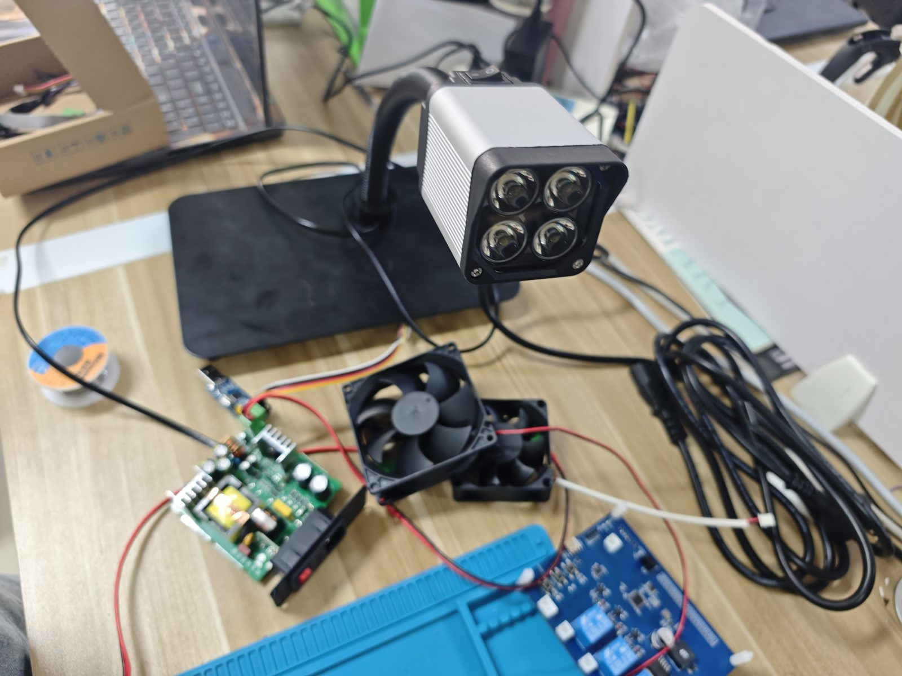

R2大风扇24V 0.12A，小风扇24V 0.24A。小风扇转速高噪音大，大风扇转速低噪音小，但主要考虑到的是整体功率，控温板大约3A，电源模块提供的输出为24V4A，使用小风扇会让整体功耗吃紧。

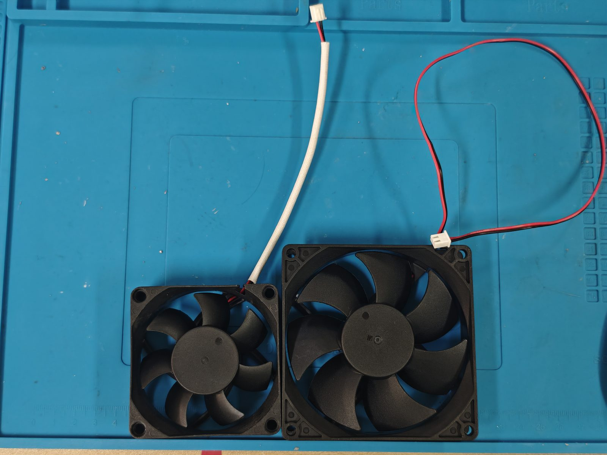

R3为5V供电口，并不是上面同样使用的24V，可以根据需求接入。

#### 4.2.5 TFT、ESP-01S 和外设接口

TFT 使用硬件 SPI1：

| TFT 功能 | STM32 引脚 |
|---|---|
| SCL / SCK | PA5 / SPI1_SCK |
| SDA / MOSI | PA7 / SPI1_MOSI |
| BLK | PA8 / TIM1_CH1 |
| RES | PB0 |
| DC | PB1 |

SPI DMA 用于减少 CPU 等待时间，背光可由 PWM 控制。界面刷新采用局部重绘，避免全屏刷新导致闪烁。

ESP-01S 使用 USART2：

| 功能 | STM32 引脚 |
|---|---|
| ESP TX -> STM32 RX | PA3 |
| ESP RX <- STM32 TX | PA2 |

控温板状态接收使用 USART3_RX/PB11；USART1/PA9、PA10 用于轻量、非阻塞调试输出。

人体传感器接入 PA1。程序使用非阻塞滤波和保持时间，避免传感器输出跳变造成继电器频繁动作。

#### 4.2.6 拓展板任务协作

拓展板主循环中的各功能不能互相阻塞：

- USART3 中断持续接收控温板字节流。
- USART1 调试输出使用轻量队列或 DMA。
- TFT 只更新变化区域。
- ESP-01S 通信按状态机处理。
- 人体检测使用时间判断，不使用长时间 `delay`。
- 继电器控制依据当前模式和状态立即更新。

### 4.3 两块板之间的通信与协同

#### 4.3.1 状态报文

```text
$T,current,setpoint,power,mode\n
```

示例：

```text
$T,326,350,42,H\n
```

字段：

| 字段 | 含义 |
|---|---|
| `$T` | 固定帧头 |
| `current` | 当前温度，异常时为 `999` |
| `setpoint` | 设定温度 |
| `power` | 加热功率百分比，范围 `0-100` |
| `mode` | 单字符状态码 |
| `\n` | LF 帧结束符 |

状态码：

| 状态码 | 含义 |
|---|---|
| `E` | 烙铁头或温度异常 |
| `O` | 关闭模式 |
| `S` | 睡眠 |
| `B` | Boost |
| `W` | 正常工作 |
| `H` | 加热 |
| `L` | 保温或低功率维持 |

#### 4.3.2 STM32 接收策略

STM32 不假设一次中断能够收到完整报文，而是按字节流解析：

1. 收到 `$` 时清空当前帧并重新同步。
2. 只接收 ASCII 可打印字符。
3. 收到 LF `0x0A` 时结束一帧。
4. 最大帧长为 32 字节，超长帧丢弃。
5. 字段数量、数值范围和状态字符必须合法。
6. 合法帧刷新控温板在线时间。
7. 坏帧只丢弃，不立即判定离线。
8. 连续 3 秒没有合法帧时判定控温板离线。

这种设计能够容忍半帧、乱码和短暂干扰，同时避免错误数据直接进入显示与控制逻辑。

## 5. 系统联调与验收

### 5.1 单独验证控温板

使用 USB-TTL 直接连接 ATmega328P `PD1/TXD`，串口设置为 `9600 8N1`。

应能看到类似：

```text
$T,320,320,12,W
$T,322,380,100,B
$T,999,320,0,E
```

如果 USB-TTL 接收稳定，而拓展板接收不稳定，应重点检查 PB11 分压、共地、USART3 配置和 PCB 走线。

### 5.2 验证拓展板

拓展板应完成：

- PC13 心跳 LED 正常。
- TFT 正常显示。
- 三路继电器可控制。
- USART3 能稳定解析控温板状态。
- 超过 3 秒未收到合法帧时显示离线。
- ESP-01S 能连接并上报 IP。
- 网页上位机可以建立 WebSocket。

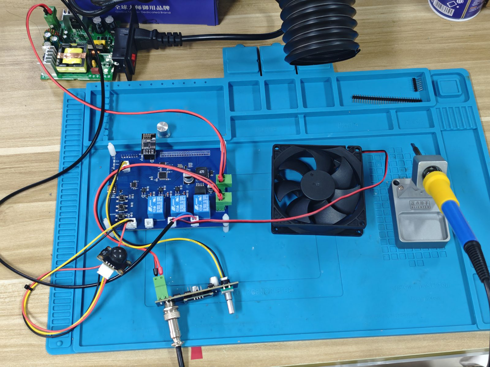

### 5.3 查看串口诊断

网页调试状态中重点关注：

| 字段 | 含义 |
|---|---|
| `rxBytes` | USART3 收到的总字节数 |
| `lines` | 收到的 LF 结束帧数量 |
| `valid` | 合法状态帧数量 |
| `bad` | 解析失败帧数量 |
| `overflow` | 超长帧或缓冲区溢出次数 |
| `ore/fe/ne/pe` | USART 硬件错误计数 |
| `raw` | 最近一帧原始内容 |

### 5.4 整机测试

整机测试建议顺序：

1. 不插手柄，确认系统不会加热。
2. 插入手柄，确认温度能够正常上升和稳定。
3. 检查控温板状态能否同步到 TFT 和网页。
4. 测试手动模式下三路继电器。
5. 测试人体传感器和自动模式。
6. 断开控温板 UART，确认拓展板在 3 秒后显示离线。
7. 断开 WiFi，确认本地控温和 TFT 不受影响。

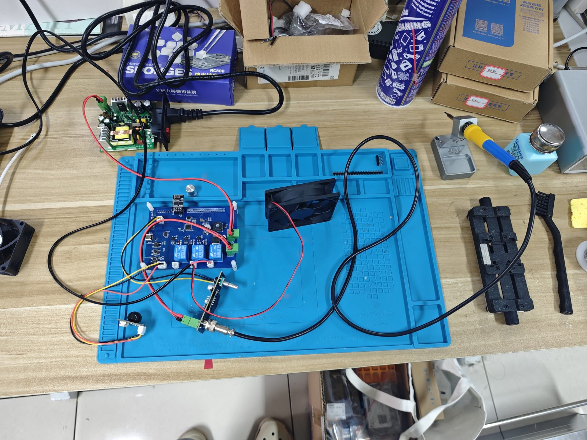


### 5.5 V2.1 验收标准

控温板：

- USBasp 可以烧录正式 HEX。
- ATmega328P 使用 16MHz 外部晶振。
- 未插手柄时上报 `current=999`、`mode=E`。
- 插入手柄后可稳定控温。
- 状态报文完整，没有尾字节截断。

拓展板：

- USART3 稳定解析 `$T` 帧。
- 控温板在线和离线判断正确。
- TFT 状态和温度曲线正常。
- 三路继电器动作正确。
- ESP-01S 和网页上位机可以连接。
- 自动模式不会因人体输入跳变而频繁动作。

## 6. 常见问题

### 6.1 USBasp 找不到设备

错误示例：

```text
cannot find USB device with vid=0x16c0 pid=0x5dc
```

检查：

- Zadig 中选择的设备是否确实是插拔后消失的 USBasp。
- 下载器 VID/PID 是否为标准 USBasp。
- 驱动是否为兼容的 `libusbK`、`libusb-win32` 或 `WinUSB`。
- Arduino IDE 中选择的 Programmer 是否与下载器一致。

### 6.2 ATmega328P 不响应 ISP

错误示例：

```text
program enable: target does not answer
```

检查：

- MOSI、MISO、SCK、RST、VCC 和 GND。
- 目标板是否供电。
- 新片或熔丝位配置是否要求外部晶振。
- ISP SCK 是否过快。

可尝试降低 ISP 速度：

```powershell
-B 125kHz
```

### 6.3 拓展板只能收到开机几帧

检查：

- PB11 是否只配置为 USART3_RX。
- ATmega TX 到 STM32 RX 的分压是否正确。
- 两块板是否共地。
- STM32 是否按 `$` 重新同步，并只用 LF 结束帧。
- `ore/fe/ne/pe` 是否持续增加。
- UART 线是否靠近继电器和加热回路。

### 6.4 TFT 闪烁、笔画缺失或曲线不流畅

常见原因：

- 高频全屏刷新。
- 动态字符绘制前先清空整个区域。
- DMA 发送未完成时修改发送缓冲区。
- 局部刷新范围计算错误。
- 字模宽度和清除区域不一致。

正确方向是保持静态背景，只重绘发生变化的最小区域。

### 6.5 ESP-01S 显示 IP 为 0.0.0.0

检查：

- ESP-01S 是否已经连接 WiFi。
- WiFi 名称和密码是否正确。
- STM32 与 ESP-01S 的 TX/RX 是否交叉连接。
- USART2 波特率是否一致。
- ESP 固件是否向 STM32 上报有效 IP。

## 7. 附录

### 7.1 项目目录

```text
.
├─ README.md
├─ docs/images
├─ 控温板
│  ├─ Hardware
│  └─ Firmware/1.7_uart_nonblocking
└─ 拓展板
   ├─ Hardware
   ├─ Firmware/SmartSolder_Extension
   └─ Software
      ├─ SmartSolder_Host.html
      └─ ESP01S_WebSocket_Bridge
```

### 7.2 拓展板关键引脚

| 模块 | STM32 引脚 | 说明 |
|---|---|---|
| 控温板 UART RX | PB11 / USART3_RX | 接 ATmega328P TX 分压后信号 |
| 控温板 UART TX | PB10 / USART3_TX | 当前预留 |
| 调试串口 TX/RX | PA9 / PA10 | USART1 |
| ESP-01S TX/RX | PA2 / PA3 | USART2 |
| TFT SCK | PA5 / SPI1_SCK | 硬件 SPI |
| TFT MOSI | PA7 / SPI1_MOSI | 硬件 SPI |
| TFT BLK | PA8 / TIM1_CH1 | 背光 PWM |
| TFT RES | PB0 | 屏幕复位 |
| TFT DC | PB1 | 数据/命令选择 |
| 人体传感器 | PA1 | 高电平有效 |
| 继电器 1 | PB13 | 照明灯 |
| 继电器 2 | PB12 | 排风扇 |
| 继电器 3 | PB14 | 预留负载 |
| 心跳 LED | PC13 | 运行状态指示 |

### 7.3 拓展板关键配置

| 功能 | 配置 |
|---|---|
| 项目文档版本 | V2.1 |
| 控温板串口 | USART3 RX，9600 8N1 |
| 调试串口 | USART1，115200 8N1 |
| ESP-01S 串口 | USART2，115200 8N1 |
| 控温板在线超时 | 3000ms |
| ESP 在线超时 | 10000ms |
| 继电器触发 | 高电平有效 |
| 人体检测 | 高电平有效 |

### 7.4 安全注意事项

- 焊台涉及高温和 24V 大电流，首次调试不要无人值守。
- 继电器控制外部负载时，必须确认触点电压、电流和绝缘距离。
- 24V 输入端建议使用保险丝、反接保护和足够线宽。
- T12 加热回路和测温信号回路应避免共用细长回流路径。
- ESP-01S 只能使用稳定的 3.3V 电源和 3.3V 串口电平。
- ATmega 5V TX 接入 STM32 RX 前必须进行电平转换或分压。
- 烧录前确认芯片型号和目标电压。

### 7.5 已知限制

- 控温板串口目前只支持状态上报，不支持拓展板向控温板下发控制命令。
- 状态帧没有校验和，依靠帧头、字段检查和超时机制保证可靠性。
- TFT 新增中文字需要继续补充字模。
- 自动模式延时策略仍需要根据实际安装环境调整。


### 一些碎碎念
    这是我第一次尝试制作一个从PCBLayout到固件和上位机落地的项目，这期间可以说是命途多舛，但好在还是完成了。
    不管你是不是506（搬校区前的小码蚁实验室）的成员，能看到这里我很高兴。如果你是506的学弟学妹在看这个项目的时候会有什么样子的感受呢，是觉得这些是很难很高深的东西，还是觉得这是一个很普通简单的项目，我都觉得不奇怪，这个项目完成于2026年6月，此时的我正在上大三，这是一个动荡的时代，是当前行业被AI浪潮冲击最猛烈的时候，对于未来我也很迷茫，但是不能否定的是，这个项目大部分内容都由AI制作和帮助落地，没有AI的帮助，这样的工程量很难一人在两周时间内完成。
    未来人类的知识获取真的会变得十分简单，我们真的不再需要多年去学会掌握一门技能，而是能够直接使用这些能力，那样的话，人们学习的意义是什么呢？这个问题时时在困扰我，在这个技术爆炸的时代，几个月甚至几周就会有AI能力的大提升，接管某个行业的生产力，我是主动拥抱AI的那部分人，但是正是因为和AI打交道，一次次地颠覆和刷新我对这些智能体的认知，在做调试的时候，拓展板和上位机的通信部分卡住了很久，但是最终还是被查到了，因为 UART 非阻塞发送，最后一个字节写进 UDR0 后，主循环可能马上继续进入 denoiseAnalog()，而 denoiseAnalog() 会执行 SLEEP_MODE_ADC。如果 UART 最后一个字节还在移位寄存器里发送，ADC 睡眠会让尾部字节变形。这样的问题我从来没有见过，虽然AI也无法很快发现，但是在AI主导的高效调试流程下，确实定位到了问题并且解决。我的造诣尚浅，换一个资深的工程师可能也未必能很快的定位到。
    AI的到来是一次机会，他把普通人和行业人的起跑线尽可能的拉到了一起，但是现在的就业很难，未来我可能正在某个大厂的办公室里面Web Coding，也可能在大学城门口卖着小吃，但无论是哪个结局我都可以接受，只要能够作为一个不能被替代的个体生活下去，这样的人生就还有意义。
    感谢史老师对这个项目的经费支持，他对我的信任极大的鼓舞了我，感谢学弟学妹们参与和维护这个项目。
    希望我的项目可以帮助到你，也能帮到未来的自己。
    2026-6-12
